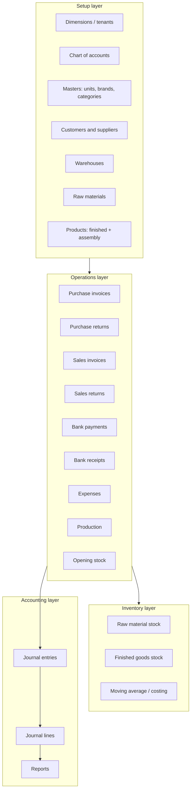
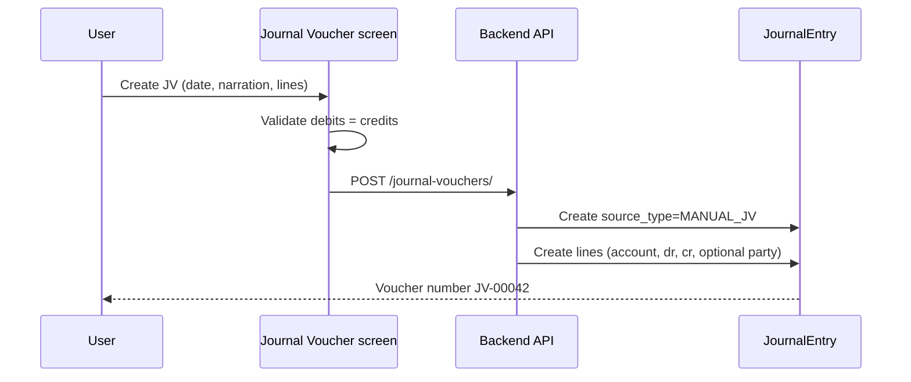

# CoreLedger ERP — Where You Stand, How Journals Work, and What to Build Next

This document is an **owner’s guide** for the Sams Traders / CoreLedger ERP. It explains what the system already does, how accounting and journals fit together, which reports you have, and what a mature ERP typically adds next.

It is written for **you as the product owner**, not as end-user click instructions. For day-to-day usage of screens, see [ERP_USER_GUIDE.md](./ERP_USER_GUIDE.md). For COA technical debt, see [COA-fix.md](./COA-fix.md) and [COA_USAGE_REVIEW.md](./COA_USAGE_REVIEW.md).

---

## 1. One-page summary

| Area | Status | Notes |
|------|--------|--------|
| **Inventory (raw + finished)** | Strong | Warehouses, opening stock, purchases, sales, returns, production |
| **Operational documents** | Strong | Purchase/sales invoices, bank pay/receive, expenses |
| **Chart of accounts** | Good | Hierarchy, postable rules, party & product COA links |
| **Automatic journals** | Good | Most money documents post balanced journal entries |
| **Financial reports** | Medium | Balance sheet, ledger, party ledger, COA completeness |
| **Manual journal vouchers** | Missing UI | Model exists in backend; no create/edit screen yet |
| **Production accounting** | Gap | Stock moves; no inventory journal on production |
| **Opening stock accounting** | Gap | Stock only; no opening balance journal |
| **P&L / Trial balance screens** | Partial | Logic exists inside balance sheet; no dedicated report pages |
| **Audit & period close** | Early | No formal period lock, reversal workflow, or audit log UI |

**Bottom line:** You have a **real mid-stage trading/manufacturing ERP** — strong on operations and inventory, with a **journal engine that already powers most reports**. You are not at “spreadsheet ERP” level anymore, but you are **not yet a full accounting suite** (manual JVs, period close, full statutory reporting pack).

---

## 2. How your ERP is organized (mental model)

Think of the system in **four layers**. Everything should eventually flow **down** into the journal layer for money truth.



### Dimensions (multi-company)

- Each **dimension** (e.g. `SAMS_TRADERS`, `AM_TRADERS`) is a separate books instance.
- Users pick the active dimension in the header; all lists, saves, and reports are scoped to it.
- Staff users can be limited to specific menu permissions per dimension.

**Rule for users:** Always confirm the active dimension before posting invoices or payments.

---

## 3. What you have today (module checklist)

### 3.1 Administrator / masters

| Feature | Route (app) | Purpose |
|---------|-------------|---------|
| Units, brands, categories | `/masters/*` | Product and raw material classification |
| Raw materials | `/raw-materials` | Purchaseable inputs, RM stock |
| Products | `/products` | Finished goods + assembly BOM |
| Production | `/production` | Manufacture assembly products (consumes RM/components, adds FG) |
| Warehouses | `/warehouses` | Stock locations |
| Chart of accounts | `/accounts` | Accounting structure |
| Staff access | `/settings/staff` | Role-based menu permissions |
| Dimensions | `/users/dimensions` | Tenant setup |

### 3.2 Purchase

| Feature | Route | Stock | Journal |
|---------|-------|-------|---------|
| Purchase invoices | `/purchase-invoices` | RM + FG in | Yes |
| Purchase returns | `/purchase-returns` | Reverses qty | Yes |
| Opening stock | `/opening-stock` | RM opening qty | No |
| Suppliers | `/suppliers` | — | Payable account on party |
| Bank payments | `/purchase-bank-payments` | — | Yes (bank vs payable) |

### 3.3 Sales

| Feature | Route | Stock | Journal |
|---------|-------|-------|---------|
| Sales invoices | `/sales-invoices` | FG out | Yes |
| Sales returns | `/sales-returns` | FG back in | Yes |
| Customers | `/customers` | — | Receivable account on party |
| Bank receipts | `/sales-bank-receipts` | — | Yes (bank vs receivable) |

### 3.4 Bank & expenses

| Feature | Route | Journal |
|---------|-------|---------|
| Expenses | `/expenses` | Dr expense, Cr bank |

### 3.5 Reports

| Report | Route | Data source |
|--------|-------|-------------|
| Balance sheet | `/reports/balance-sheet` | **Journal lines** (as-of date) |
| Ledger | `/reports/ledger` | **Journal lines** (account / party) |
| Party ledger | `/reports/party-ledger` | **Journal lines** (customer/supplier) |
| COA completeness | `/reports/coa-completeness` | Setup validation (missing COAs) |
| Dashboard | `/` | Mix: documents + journal health |

### 3.6 Platform

- Login, JWT auth, admin panel for users/inquiries
- Support inquiries
- Print preview for purchase invoices
- Multi-dimension “create in” for some masters (purchase invoice is single-dimension)

---

## 4. How journals work in your ERP (today)

### 4.1 What is a journal entry?

In proper accounting, every financial event is recorded as a **balanced voucher**:

- One **journal entry** (header): date, reference, document type, description, party name.
- Multiple **journal lines** (details): account, debit, credit.

**Golden rule:** Total debits = total credits for every entry.

Your backend enforces this in `samspython/accounts/journal.py` before saving.

### 4.2 Automatic journals (source documents)

When you save or update certain documents, the system **creates or updates** one journal entry linked to that document (`source_type` + `source_id`). If you edit the document, the journal is **replaced** (upsert), not duplicated.

| Business event | `source_type` | Typical accounting effect (simplified) |
|----------------|---------------|----------------------------------------|
| Purchase invoice | `PURCHASE_INVOICE` | Dr inventory (by line), Cr supplier payable |
| Purchase return | `PURCHASE_RETURN` | Reverses purchase effect |
| Purchase bank payment | `PURCHASE_BANK_PAYMENT` | Dr payable, Cr bank |
| Sales invoice | `SALES_INVOICE` | Dr receivable, Cr revenue; Dr COGS, Cr inventory |
| Sales return | `SALES_RETURN` | Reverses sales effect |
| Sales bank receipt | `SALES_BANK_RECEIPT` | Dr bank, Cr receivable |
| Expense | `EXPENSE` | Dr expense account, Cr bank |

**Requirements for posting to succeed:**

- Products/raw materials need **inventory / COGS / revenue** accounts (on item or category).
- Customers/suppliers need **control (receivable/payable)** accounts.
- Bank payments/receipts/expenses need **postable BANK** asset accounts.
- Amounts must balance after line building.

If posting fails, fix COA mapping first (use **COA Completeness** report), then re-save the document or run journal sync (below).

### 4.3 Re-sync all journals (maintenance)

Command:

```bash
cd samspython
python manage.py sync_journals
```

Use when:

- You fixed COA mappings on old products/parties.
- You suspect journals are out of date after data imports.
- After deploying journal logic fixes.

This replays journal builders for all active purchase/sales/bank/expense documents.

### 4.4 What does **not** post journals yet

| Event | Stock updated? | Journal? | Impact on books |
|-------|----------------|----------|-----------------|
| **Production** | Yes | **No** | Inventory value moves in warehouse logic but not always in GL inventory accounts via production voucher |
| **Opening stock** | Yes | **No** | Opening quantities exist; opening **accounting** equity/inventory adjustment may be missing |
| **Manual adjustments** | — | **No UI** | Cannot post depreciation, accruals, corrections from app |

This is the main gap between **warehouse truth** and **accounting truth**.

---

## 5. Journal vouchers — what they are and how they **should** work

### 5.1 Definition

A **journal voucher (JV)** is a manual accounting entry **not** tied to a purchase invoice or sales invoice. Examples:

- Bank charges not captured as expense document
- Depreciation
- Salary accrual
- Opening balance transfer when migrating from old software
- Correction: wrong account on an old entry (via reversing JV + new JV)
- Capital introduced by owner
- Write-off of bad debt

Your tests already create entries with `document_type = "Journal Voucher"`. Party ledger summaries also expect a **“Journal Voucher”** column for customers and suppliers.

### 5.2 Recommended JV workflow (target design)



**Fields to include:**

| Field | Purpose |
|-------|---------|
| Voucher no. | Auto `JV-00001` per dimension |
| Date | Accounting date |
| Reference / external ref | Cheque no., auditor ref |
| Narration | Why this entry exists |
| Lines | Account, debit, credit, line memo |
| Optional party | Customer/supplier name on line (for party ledger) |
| Attachments | Scan of supporting document (future) |
| Status | Draft → Posted (future); Posted → Reversed (future) |

**Rules:**

1. Cannot post if debits ≠ credits.
2. Cannot use non-postable or inactive accounts.
3. Posted JVs should be **locked**; changes only via reversal voucher.
4. List screen: filter by date, account, amount, user.

### 5.3 Where JVs appear in reports

| Report | Should show JVs? |
|--------|------------------|
| Ledger (GL) | Yes — by account |
| Party ledger | Yes — when line has `people_type` / `people_name` |
| Balance sheet | Yes — flows into balances |
| Trial balance | Yes |
| P&L | Yes — for income/expense lines |

Today, **only automatic document journals** populate these reports unless you insert JVs via database/tests.

---

## 6. Reports — what you have vs what mature ERPs add

### 6.1 Currently available (use these)

**Balance sheet** (`/reports/balance-sheet`)

- Built from **journal lines** up to an “as of” date.
- Shows assets, liabilities, equity hierarchy.
- Includes **unclosed profit/loss** hint (income/expense not formally closed to equity).
- Shows **difference** if assets ≠ liabilities + equity (books not balanced).

**Ledger report** (`/reports/ledger`)

- Filter: GL account code, or supplier, or customer.
- Date range.
- Lists debits/credits from journals.
- Good for auditor-style account review.

**Party ledger** (`/reports/party-ledger`)

- One customer or one supplier.
- Summarizes document types: invoices, returns, bank movements, journal vouchers.
- Built from journal lines tagged with party name.

**COA completeness** (`/reports/coa-completeness`)

- Operational hygiene: products/parties missing required accounts.
- Run after setup or before month-end.

**Dashboard**

- Sales, purchases, receipts, payments, stock values, journal health, top parties.
- Good for management glance; not a substitute for formal financial statements.

### 6.2 High-value reports to add next

| Priority | Report | Why |
|----------|--------|-----|
| **P0** | **Trial balance** | Lists every account with opening, movement, closing — accountant’s daily tool |
| **P0** | **Profit & loss (P&L)** | Revenue, COGS, expenses, net profit for a period |
| **P0** | **Journal voucher register** | List all JVs with drill-down to lines |
| **P1** | **General ledger export** | Excel/PDF for date range, all accounts |
| **P1** | **Aged receivables** | Customer invoices by age bucket |
| **P1** | **Aged payables** | Supplier invoices by age bucket |
| **P1** | **Stock valuation** | RM + FG qty × cost by warehouse |
| **P1** | **Production cost report** | RM consumed vs FG produced in period |
| **P2** | **Sales analysis** | By product, customer, margin |
| **P2** | **Purchase analysis** | By supplier, item |
| **P2** | **Cash book / bank book** | All bank account movements |
| **P2** | **Day book** | Chronological all vouchers |
| **P3** | **Tax / GST reports** | If statutory requirement |
| **P3** | **Budget vs actual** | Management accounting |

### 6.3 Inventory reports (operations)

| Report | Purpose |
|--------|---------|
| Stock ledger (item-wise) | Opening + in + out + balance per RM/FG |
| Low stock alert | Below minimum reorder |
| Dead stock | No movement in N days |
| BOM explosion | Assembly → components |
| Batch / serial trace | If you add batch tracking later |

---

## 7. Accounting maturity: how documents should post (target state)

### 7.1 Purchase invoice (already implemented)

Example logic (conceptual):

```
For each line:
  Dr Inventory (RM or FG account)     = line amount
Cr Supplier payable                  = invoice net
```

Discounts and invoice-level discount are reflected in net amounts on the document builder.

### 7.2 Sales invoice (already implemented)

Conceptual:

```
Dr Customer receivable               = net sales
  Cr Revenue                         = by product revenue account
Dr COGS                              = cost of qty sold
  Cr Inventory (FG)                  = at average cost
```

Profit on the invoice line in the UI comes from **selling price − average cost**.

### 7.3 Production (recommended future journals)

When you manufacture, accounting should reflect **value moving from components to finished goods**:

Conceptual (simplified):

```
Dr Finished goods inventory (at production cost)    = total production value
  Cr Raw material inventory                         = RM component value
  Cr WIP / clearing (optional)                      = labour + moulding + packaging
```

Today production updates **quantities** and costing on products; adding journals would align the balance sheet inventory accounts with warehouse valuation.

### 7.4 Opening stock (recommended future journals)

When you enter opening RM or FG quantities:

Conceptual:

```
Dr Inventory (opening)              
  Cr Opening balance equity / retained earnings
```

Without this, balance sheet inventory accounts may not match physical opening stock.

### 7.5 Period-end close (future)

Standard month-end:

1. Run trial balance — must balance.
2. Post adjusting JVs (accruals, depreciation).
3. **Close income/expense to retained earnings** (system-generated JV).
4. Lock the period — no backdated edits without admin unlock.

Your balance sheet already computes **unclosed profit/loss**; formal close would move that into equity explicitly.

---

## 8. COA and category templates (important nuance)

Categories can store default **inventory, COGS, and revenue** accounts. Products and raw materials can override them.

**Journal posting** resolves accounts in this order:

1. Product or raw material account (if set)
2. Else category account
3. Else error — posting blocked

**Gap (documented in COA_USAGE_REVIEW.md):**

- Category COAs are not always auto-copied to new products in the UI.
- Users should set accounts on products (or use category defaults when implemented).
- Use **COA Completeness** before go-live on a new dimension.

---

## 9. Where your ERP stands (honest scorecard)

Scale: **1 = not started**, **5 = production-grade for SMEs**

| Capability | Score | Comment |
|------------|-------|---------|
| Master data | 4/5 | Solid masters; module toggles per client still manual |
| Purchase cycle | 4/5 | Invoice, return, payment, due tracking |
| Sales cycle | 4/5 | Invoice, return, receipt, margin on lines |
| Inventory | 4/5 | RM + FG, production, returns; batch/serial not yet |
| Banking & expenses | 4/5 | Good coverage |
| COA structure | 4/5 | Hierarchy + account types (BANK, etc.) |
| Auto journals | 4/5 | Core documents covered |
| Manual journals | 1/5 | Backend-ready, no UI |
| Financial statements | 3/5 | Balance sheet strong; P&L/TB screens missing |
| Statutory / audit pack | 2/5 | Export/print limited |
| Multi-tenant SaaS readiness | 3/5 | Dimensions + staff; needs ops hardening |
| Customization per client | 2/5 | Permission-based; no feature flags table yet |

**Comparable stage:** A focused **inventory + trading ERP for 1–5 legal entities**, ready for daily operations, **approaching** full books if you add JVs, production/opening journals, and P&L/TB.

---

## 10. Recommended roadmap (practical order)

### Phase A — Accounting completeness (1–2 months)

1. **Journal voucher UI** — create, list, view, soft-delete; `source_type = MANUAL_JV`.
2. **Trial balance** page — journal-based, date range.
3. **Profit & loss** page — reuse logic from `build_balance_sheet_report` income/expense split.
4. **Journal register** — all entries with filters by source type.
5. **Production journal** — post on production save/update/delete.
6. **Opening stock journal** — optional checkbox “post accounting entry”.

### Phase B — Management reporting (1–2 months)

1. Aged receivables / payables.
2. Stock valuation report (RM + FG).
3. PDF/Excel export on ledger, balance sheet, P&L.
4. Print layouts for sales/purchase documents (consistent branding).

### Phase C — Control & trust (ongoing)

1. Period lock (no edit before date X without role).
2. Audit log: who changed amount, date, account.
3. Draft vs posted documents for invoices.
4. Reversal workflow for JVs and key documents.
5. Staging environment + automated tests on journal balance.

### Phase D — Growth (when selling to more clients)

1. Per-tenant module flags (hide raw materials, production, etc.).
2. Parameterized PDF templates per tenant.
3. API for integrations (e-commerce, POS).
4. Optional: database-per-tenant for large clients.

See also [flow.md](./flow.md) for multi-client hosting and customization strategy.

---

## 11. Daily discipline (habits that keep books clean)

1. **Set COA on every product, raw material, customer, and supplier** before first transaction.
2. Run **COA Completeness** after bulk imports.
3. Reconcile **party ledger** balance to outstanding invoices monthly.
4. Reconcile **bank ledger** to bank statement monthly.
5. After COA fixes on old data, run `python manage.py sync_journals`.
6. Investigate any **non-zero difference** on balance sheet before trusting the report.
7. Do not delete posted documents casually — prefer returns and reversing JVs.
8. Train users: **dimension switch** is not cosmetic; wrong dimension = wrong books.

---

## 12. Glossary

| Term | Meaning in this ERP |
|------|---------------------|
| **Dimension** | Separate company/branch books (tenant) |
| **Assembly product** | Manufactured item with BOM (raw materials + other products) |
| **Finished good** | Sold/purchased product with direct price or simple stock |
| **Journal entry** | Accounting voucher header |
| **Journal line** | One debit or credit row |
| **Postable account** | Leaf COA account that can receive transactions |
| **Party ledger** | Customer or supplier statement from journals |
| **COGS** | Cost of goods sold — expense when you sell |
| **Unclosed P&L** | Profit/loss not yet transferred to equity in a closing entry |

---

## 13. Related files in this repo

| File | Topic |
|------|--------|
| [ERP_USER_GUIDE.md](./ERP_USER_GUIDE.md) | Screen-by-screen usage |
| [COA-fix.md](./COA-fix.md) | COA engine evolution plan |
| [COA_USAGE_REVIEW.md](./COA_USAGE_REVIEW.md) | How COA is wired today |
| [flow.md](./flow.md) | Multi-client, PWA, scaling questions |
| [RAW_MATERIAL_INVENTORY_SCENARIO_1.md](./RAW_MATERIAL_INVENTORY_SCENARIO_1.md) | RM inventory scenario |
| [API_CONTRACT.md](./API_CONTRACT.md) | API conventions |
| `samspython/accounts/journal.py` | Journal builders (source of truth for auto posting) |
| `samspython/accounts/reporting.py` | Ledger and balance sheet builders |

---

## 14. Final word

You are past the “demo ERP” stage. Operations teams can run purchase, sale, production, and banking in one app, and **accountants can already use balance sheet and ledgers fed by real journal entries** for most transactions.

The next leap to **“complete books”** is not one big rewrite — it is:

- **Manual journal vouchers** for everything automatic posting cannot cover  
- **Journals for production and opening stock** so inventory accounts match warehouses  
- **Trial balance + P&L** as first-class reports  
- **Period discipline** (lock, audit, reversal)

Build those in order, and CoreLedger becomes credible for external accountants and for pitching to new clients with confidence.

---

*Document version: May 2026 — aligned with codebase at Sams Traders / CoreLedger.*
